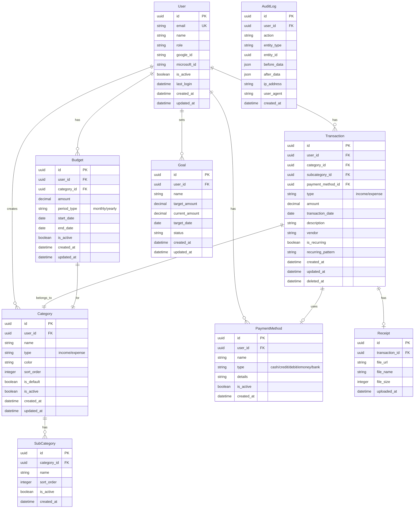

# 家計管理アプリケーション 基本設計書

## 1. システムアーキテクチャ

### 1.1 全体構成

```
┌─────────────────────────────────────────────────────────┐
│                     クライアント層                        │
│  ┌─────────────────────────────────────────────────┐   │
│  │    Next.js + React + TypeScript (Vercel)         │   │
│  │    - SSR/SSG                                     │   │
│  │    - React Components                            │   │
│  │    - Tailwind CSS                                │   │
│  └─────────────────────────────────────────────────┘   │
└─────────────────────────────────────────────────────────┘
                           ↓ HTTPS
┌─────────────────────────────────────────────────────────┐
│                      API層                              │
│  ┌─────────────────────────────────────────────────┐   │
│  │    Next.js API Routes (Vercel)                   │   │
│  │    - RESTful API                                 │   │
│  │    - NextAuth.js                                 │   │
│  │    - Middleware                                  │   │
│  └─────────────────────────────────────────────────┘   │
└─────────────────────────────────────────────────────────┘
                           ↓
┌─────────────────────────────────────────────────────────┐
│                    データアクセス層                       │
│  ┌─────────────────────────────────────────────────┐   │
│  │         Prisma ORM                               │   │
│  │    - Type-safe database access                   │   │
│  │    - Migration management                        │   │
│  └─────────────────────────────────────────────────┘   │
└─────────────────────────────────────────────────────────┘
                           ↓
┌─────────────────────────────────────────────────────────┐
│                     データベース層                        │
│  ┌─────────────────────────────────────────────────┐   │
│  │      Supabase (PostgreSQL)                       │   │
│  │    - Row Level Security                          │   │
│  │    - Real-time subscriptions                     │   │
│  └─────────────────────────────────────────────────┘   │
└─────────────────────────────────────────────────────────┘
                           ↓
┌─────────────────────────────────────────────────────────┐
│                    外部サービス                          │
│  ┌──────────────┐  ┌──────────────┐  ┌──────────┐   │
│  │ Google OAuth │  │ Microsoft    │  │ Storage  │   │
│  │     2.0      │  │  Entra ID    │  │ (Supabase│   │
│  └──────────────┘  └──────────────┘  └──────────┘   │
└─────────────────────────────────────────────────────────┘
```

### 1.2 ディレクトリ構成

```
family-finance/
├── app/                    # Next.js App Router
│   ├── (auth)/             # 認証関連ページ
│   │   ├── login/
│   │   └── register/
│   ├── (dashboard)/        # ダッシュボード
│   │   ├── page.tsx
│   │   ├── income/
│   │   ├── expense/
│   │   ├── analysis/
│   │   ├── budget/
│   │   └── settings/
│   ├── api/                # API Routes
│   │   ├── auth/[...nextauth]/
│   │   ├── transactions/
│   │   ├── categories/
│   │   ├── reports/
│   │   └── users/
│   ├── layout.tsx
│   └── globals.css
├── components/             # React Components
│   ├── common/
│   ├── forms/
│   ├── charts/
│   └── layouts/
├── lib/                    # ライブラリ
│   ├── auth/
│   ├── db/
│   └── utils/
├── hooks/                  # Custom Hooks
├── types/                  # TypeScript型定義
├── utils/                  # ユーティリティ関数
└── middleware.ts           # Middleware
├── prisma/
│   ├── schema.prisma
│   └── migrations/
├── public/
├── tests/
├── .env.local
├── next.config.js
├── tailwind.config.js
├── tsconfig.json
└── package.json
```

## 2. データベース設計

### 2.1 ER図



### 2.2 テーブル定義

#### 2.2.1 Users（ユーザー）

| カラム名 | データ型 | NULL | デフォルト | 説明 |
|---------|----------|------|------------|------|
| id | UUID | NO | uuid_generate_v4() | 主キー |
| email | VARCHAR(255) | NO | - | メールアドレス（ユニーク） |
| name | VARCHAR(100) | NO | - | ユーザー名 |
| role | VARCHAR(20) | NO | 'user' | ロール（admin/user） |
| google_id | VARCHAR(255) | YES | - | Google認証ID |
| microsoft_id | VARCHAR(255) | YES | - | Microsoft認証ID |
| is_active | BOOLEAN | NO | true | アクティブフラグ |
| last_login | TIMESTAMP | YES | - | 最終ログイン日時 |
| created_at | TIMESTAMP | NO | now() | 作成日時 |
| updated_at | TIMESTAMP | NO | now() | 更新日時 |

#### 2.2.2 Transactions（取引）

| カラム名 | データ型 | NULL | デフォルト | 説明 |
|---------|----------|------|------------|------|
| id | UUID | NO | uuid_generate_v4() | 主キー |
| user_id | UUID | NO | - | ユーザーID（外部キー） |
| category_id | UUID | NO | - | カテゴリーID（外部キー） |
| subcategory_id | UUID | YES | - | サブカテゴリーID |
| payment_method_id | UUID | YES | - | 支払方法ID |
| type | VARCHAR(20) | NO | - | 種別（income/expense） |
| amount | DECIMAL(12,2) | NO | - | 金額 |
| transaction_date | DATE | NO | - | 取引日 |
| description | TEXT | YES | - | 説明 |
| vendor | VARCHAR(255) | YES | - | 取引先 |
| is_recurring | BOOLEAN | NO | false | 定期取引フラグ |
| recurring_pattern | VARCHAR(50) | YES | - | 繰り返しパターン |
| created_at | TIMESTAMP | NO | now() | 作成日時 |
| updated_at | TIMESTAMP | NO | now() | 更新日時 |
| deleted_at | TIMESTAMP | YES | - | 論理削除日時 |

### 2.3 インデックス設計

```sql
-- Users
CREATE UNIQUE INDEX idx_users_email ON users(email);
CREATE INDEX idx_users_google_id ON users(google_id);
CREATE INDEX idx_users_microsoft_id ON users(microsoft_id);

-- Transactions
CREATE INDEX idx_transactions_user_id ON transactions(user_id);
CREATE INDEX idx_transactions_category_id ON transactions(category_id);
CREATE INDEX idx_transactions_date ON transactions(transaction_date);
CREATE INDEX idx_transactions_type ON transactions(type);
CREATE INDEX idx_transactions_user_date ON transactions(user_id, transaction_date);

-- Categories
CREATE INDEX idx_categories_user_id ON categories(user_id);
CREATE INDEX idx_categories_type ON categories(type);

-- Budget
CREATE INDEX idx_budget_user_id ON budget(user_id);
CREATE INDEX idx_budget_category_id ON budget(category_id);
```

## 3. API設計

### 3.1 認証API

#### POST /api/auth/login
```typescript
// Request
{
  provider: "google" | "microsoft",
  token: string
}

// Response
{
  success: boolean,
  user: {
    id: string,
    email: string,
    name: string,
    role: string
  },
  token: string,
  refreshToken: string
}
```

### 3.2 取引API

#### GET /api/transactions
```typescript
// Query Parameters
{
  startDate?: string,
  endDate?: string,
  type?: "income" | "expense",
  categoryId?: string,
  page?: number,
  limit?: number
}

// Response
{
  success: boolean,
  data: Transaction[],
  pagination: {
    total: number,
    page: number,
    limit: number,
    totalPages: number
  }
}
```

#### POST /api/transactions
```typescript
// Request
{
  type: "income" | "expense",
  amount: number,
  categoryId: string,
  subcategoryId?: string,
  paymentMethodId?: string,
  transactionDate: string,
  description?: string,
  vendor?: string,
  isRecurring?: boolean,
  recurringPattern?: string
}

// Response
{
  success: boolean,
  data: Transaction
}
```

#### PUT /api/transactions/:id
#### DELETE /api/transactions/:id

### 3.3 カテゴリAPI

#### GET /api/categories
#### POST /api/categories
#### PUT /api/categories/:id
#### DELETE /api/categories/:id

### 3.4 レポートAPI

#### GET /api/reports/summary
```typescript
// Query Parameters
{
  period: "daily" | "monthly" | "yearly",
  startDate: string,
  endDate: string
}

// Response
{
  success: boolean,
  data: {
    totalIncome: number,
    totalExpense: number,
    balance: number,
    categoryBreakdown: {
      category: string,
      amount: number,
      percentage: number
    }[]
  }
}
```

## 4. 画面設計

### 4.1 画面一覧

| 画面ID | 画面名 | URL | 説明 |
|--------|--------|-----|------|
| SC001 | ログイン画面 | /login | OAuth認証選択 |
| SC002 | ダッシュボード | /dashboard | 収支サマリー表示 |
| SC003 | 収入一覧 | /dashboard/income | 収入履歴表示 |
| SC004 | 収入登録 | /dashboard/income/new | 新規収入登録 |
| SC005 | 支出一覧 | /dashboard/expense | 支出履歴表示 |
| SC006 | 支出登録 | /dashboard/expense/new | 新規支出登録 |
| SC007 | 分析画面 | /dashboard/analysis | グラフ表示 |
| SC008 | 予算管理 | /dashboard/budget | 予算設定・確認 |
| SC009 | カテゴリ管理 | /dashboard/settings/categories | カテゴリ設定 |
| SC010 | 設定画面 | /dashboard/settings | 各種設定 |

### 4.2 画面レイアウト

#### 共通レイアウト
```
┌──────────────────────────────────────────────────┐
│                   ヘッダー                        │
│  ロゴ    　　　　　　　　　　　　ユーザー名 ログアウト │
├──────────────────────────────────────────────────┤
│ サイドバー │           メインコンテンツ            │
│            │                                     │
│ ダッシュボード│                                     │
│ 収入管理    │                                     │
│ 支出管理    │                                     │
│ 分析       │                                     │
│ 予算管理    │                                     │
│ 設定       │                                     │
│            │                                     │
└──────────────────────────────────────────────────┘
```

### 4.3 レスポンシブデザイン

#### ブレークポイント
- Mobile: 0-639px
- Tablet: 640px-1023px
- Desktop: 1024px以上

## 5. セキュリティ設計

### 5.1 認証・認可

#### 認証フロー
```
1. ユーザーがログインボタンをクリック
2. OAuth プロバイダー選択（Google/Microsoft）
3. プロバイダーの認証画面へリダイレクト
4. 認証成功後、コールバックURLへリダイレクト
5. アクセストークン取得
6. ユーザー情報取得・検証
7. ホワイトリストチェック
8. JWTトークン発行
9. セッション作成
```

### 5.2 アクセス制御

#### ミドルウェア実装
```typescript
// middleware.ts
export function middleware(request: NextRequest) {
  // 認証チェック
  const token = request.cookies.get('token')
  if (!token) {
    return NextResponse.redirect('/login')
  }
  
  // トークン検証
  const decoded = verifyJWT(token)
  if (!decoded) {
    return NextResponse.redirect('/login')
  }
  
  // ホワイトリストチェック
  if (!isWhitelisted(decoded.email)) {
    return NextResponse.redirect('/unauthorized')
  }
  
  return NextResponse.next()
}
```

### 5.3 データ保護

#### Row Level Security (RLS)
```sql
-- Supabase RLS Policy
CREATE POLICY "Users can only see their own data"
  ON transactions
  FOR ALL
  USING (auth.uid() = user_id);
```

## 6. パフォーマンス設計

### 6.1 キャッシュ戦略

#### データキャッシュ
- React Query / SWRによるクライアントサイドキャッシュ
- Next.js ISR（Incremental Static Regeneration）
- Vercel Edge Caching

### 6.2 最適化

#### コード分割
```typescript
// 動的インポート
const ChartComponent = dynamic(() => import('@/components/charts/ChartComponent'), {
  loading: () => <p>Loading...</p>,
  ssr: false
})
```

#### 画像最適化
- Next.js Image Component使用
- WebP形式への自動変換
- Lazy Loading実装

## 7. エラー処理設計

### 7.1 エラーコード体系

| コード | カテゴリ | 説明 |
|--------|----------|------|
| 1xxx | 認証エラー | 認証・認可関連 |
| 2xxx | 検証エラー | 入力値検証 |
| 3xxx | データエラー | データベース関連 |
| 4xxx | 外部サービスエラー | 外部API関連 |
| 5xxx | システムエラー | サーバー内部エラー |

### 7.2 エラーレスポンス

```typescript
interface ErrorResponse {
  success: false,
  error: {
    code: string,
    message: string,
    details?: any
  }
}
```

## 8. バッチ処理設計

### 8.1 定期実行バッチ

| バッチ名 | 実行タイミング | 処理内容 |
|----------|--------------|----------|
| 定期取引登録 | 毎日 0:00 | 定期収支の自動登録 |
| バックアップ | 毎日 2:00 | データバックアップ |
| レポート生成 | 月初 0:00 | 月次レポート作成 |
| 予算アラート | 毎日 9:00 | 予算超過チェック |

### 8.2 実装方法
- Vercel Cron Jobs使用
- Next.js API Routesで実装

## 9. ログ設計

### 9.1 ログレベル

| レベル | 用途 |
|--------|------|
| ERROR | エラー発生時 |
| WARN | 警告事項 |
| INFO | 通常処理 |
| DEBUG | デバッグ情報 |

### 9.2 ログ出力項目

```typescript
interface LogEntry {
  timestamp: string,
  level: string,
  userId?: string,
  action: string,
  message: string,
  metadata?: any,
  stackTrace?: string
}
```

## 10. テスト設計

### 10.1 テスト種別

| 種別 | ツール | カバレッジ目標 |
|------|--------|--------------|
| 単体テスト | Jest, React Testing Library | 80% |
| 統合テスト | Jest, Supertest | 70% |
| E2Eテスト | Playwright | 主要シナリオ |

### 10.2 テストシナリオ

#### 認証テスト
1. 正常ログイン
2. ホワイトリスト外アクセス拒否
3. トークン期限切れ
4. 不正トークン

#### 取引テスト
1. 収支登録
2. 収支編集
3. 収支削除
4. 検索・フィルタリング

## 11. デプロイメント設計

### 11.1 環境構成

| 環境 | URL | 用途 |
|------|-----|------|
| 開発 | localhost:3000 | 開発作業 |
| ステージング | staging.family-finance.vercel.app | テスト |
| 本番 | family-finance.vercel.app | 本番運用 |

### 11.2 CI/CD

```yaml
# GitHub Actions
name: Deploy
on:
  push:
    branches: [main]
jobs:
  deploy:
    runs-on: ubuntu-latest
    steps:
      - uses: actions/checkout@v2
      - uses: actions/setup-node@v2
      - run: npm ci
      - run: npm run test
      - run: npm run build
      - run: vercel deploy --prod
```

## 12. 監視設計

### 12.1 監視項目

| 項目 | ツール | アラート閾値 |
|------|--------|------------|
| アップタイム | Vercel Analytics | 99% |
| レスポンスタイム | Vercel Analytics | 3秒 |
| エラーレート | Sentry | 1% |
| データベース負荷 | Supabase Dashboard | 80% |

### 12.2 アラート通知
- Email通知
- Slack通知（オプション）

---
作成日：2024年11月
作成者：システム設計チーム
バージョン：1.0